```{r setup, include=FALSE}
options(htmltools.dir.version = FALSE)
xaringanExtra::use_tile_view()
xaringanExtra::use_panelset()
```


```{r xaringan-themer, include=FALSE, warning=FALSE}
library(xaringanthemer)
style_duo_accent(
  primary_color = "#000000",
  secondary_color = "#495266",
  inverse_header_color = "#F1FC9D"
)
```


## Goal-directed behavior

--

- Goals that people pursue can be associated with environmental cues

<br>
--

<span style='font-size:100px;'>&#128243;</span>
--

--
<span style='font-size:100px;'>&#129306;</span>

--

<br>

- Sounds like habitual behavior

<br>

--
- Whether the behavior is instigated by the anticipation of a goal or by the cue-behavior association

---
## Desire criteria of goal-directed behavior

--
- The role of value in action-outcome representations is not clear(Custers &
Aarts, 2005; Marien et al., 2015; Watson et al., 2018)

<br>

--
- Higher goal(outcome) value, stronger behavior index

<br>

--
- Existing studies have tested this question through a phenomenon: PIT

---
## Pavlvoian-to-Instrumental Transfer (PIT) and Specific PIT

<br>

.center[]

---
## Specific PIT in human studies

.panelset[
.panel[.panel-name[ Value effect ]

<br>


- Existing studies implemented a free choice task to test specific PIT

<br>


 .center[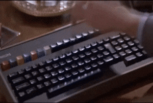]


<br>


- However, the results that whether value of the goal (outcome) can moderate specific PIT effect were mixed


]

.panel[.panel-name[ We argue... ]

<br>
- Free-choice task might be an issue

<br>

- It may confound with the task-strategic processing

<br>

- A forced choice task + Interference paradigm

<br>

- When a cue triggers a response that is same from the one required by the task + the cue or the response associates with a high or low value outcome


]

]

---
## Flowchart of Exp 1

.panelset[
.panel[.panel-name[ Demo phase ]

.center[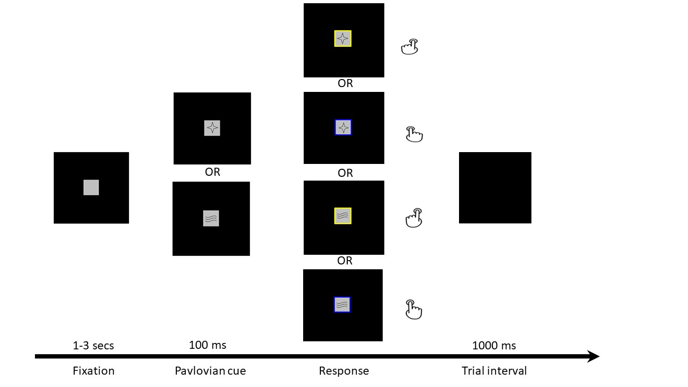]
]

.panel[.panel-name[ Instrumental ]
.center[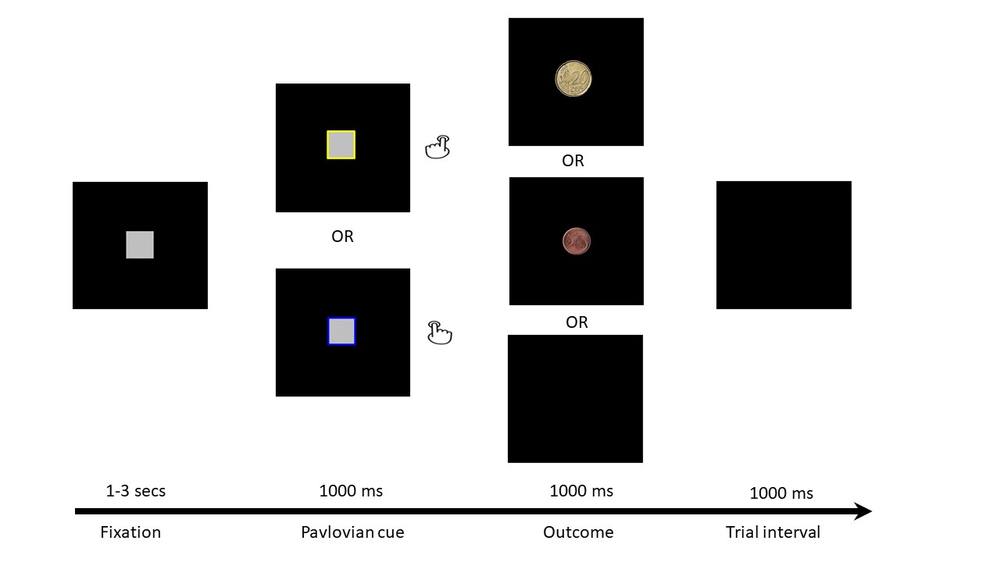]


]

.panel[.panel-name[ Pavlovian ]
.center[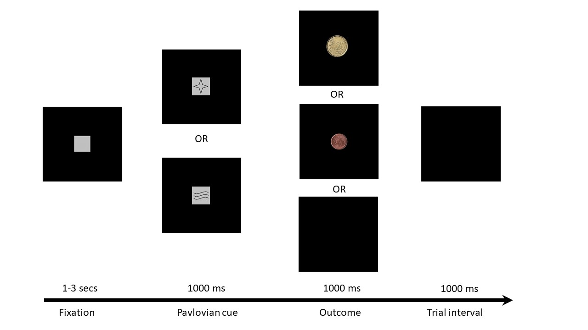]


]

.panel[.panel-name[ Transfer test ]
.center[]


]
]
---
## Construct a RT based paradigm and test it

.panelset[
.panel[.panel-name[ Design ]

<br>


 - DV: RTs (first response) and ACCs in the test phase.

<br>


 - 2(Response value high vs. low)*2(Pavlovian cue value high vs.low) within participants design


]

.panel[.panel-name[ Hypotheses ]

<br>

 RTs: Participants respond faster when the cue and the response lead to the same outcome, and this effect is more pronounced on the high value (20cents) cue condition.

<br>

 ACCs (exploratory): Participants respond more accurately when the cue and the response lead to the same outcome, and this effect is more pronounced on the high value (20cents) cue condition.

]

]


---
## Results of Exp 1
.panelset[
.panel[.panel-name[ RTs ]

Planned contrast:*F* (1, 39) = 6.49, *p* = .015, *ƞ<sub>p</sub><sup>2</sup>* = .14 [0.017; 0.316]

.center[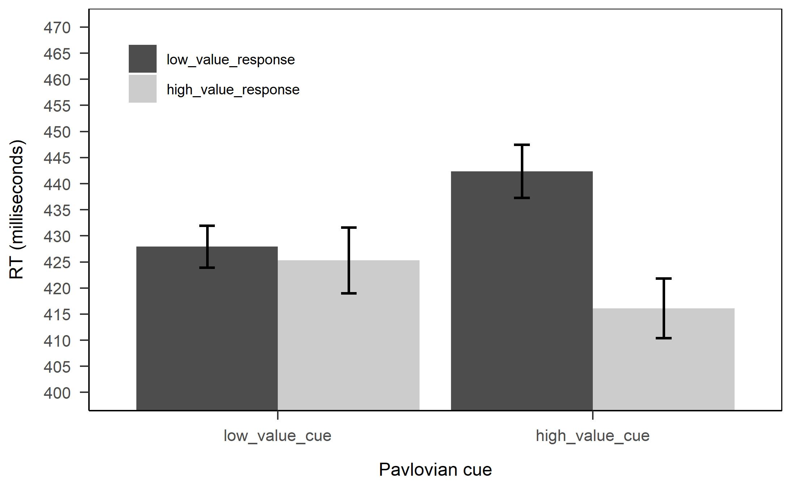]
]

.panel[.panel-name[ ACCs ]

Planned contrast:*F* (1, 39) = 0.03 *p* =.868

.center[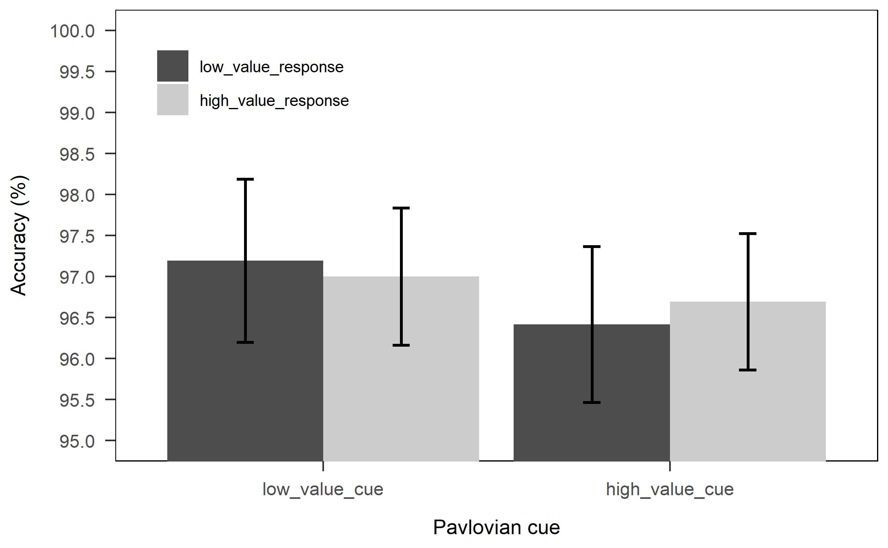]
]

.panel[.panel-name[ replicatable ? ]


 .center[- More trials in the test phase (40 to 160)]

<br>

 .center[- High value coin (20 cents to 50 cents)]

]

]

---
## Results of Exp 2
.panelset[
.panel[.panel-name[ RTs ]

Planned contrast: *F* (1, 55) = 4.40, *p* = .041, *ƞ<sub>p</sub><sup>2</sup>* = .07 [0.002; 0.205]

.center[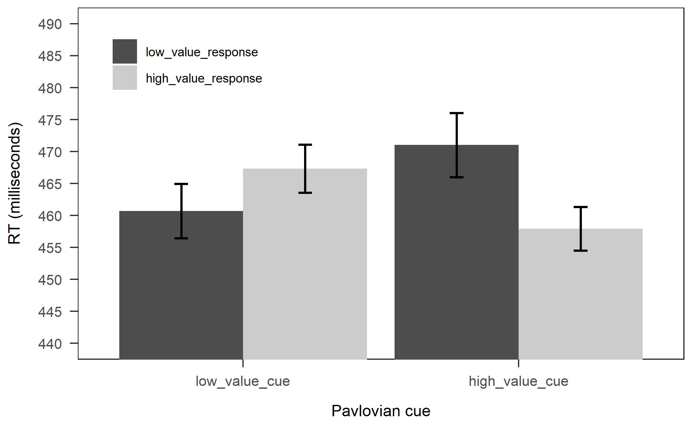]
]

.panel[.panel-name[ ACCs ]

Planned contrast:*F* (1, 55) = 7.36, *p* = .009, *ƞ<sub>p</sub><sup>2</sup>* = .12 [0.018; 0.260]

.center[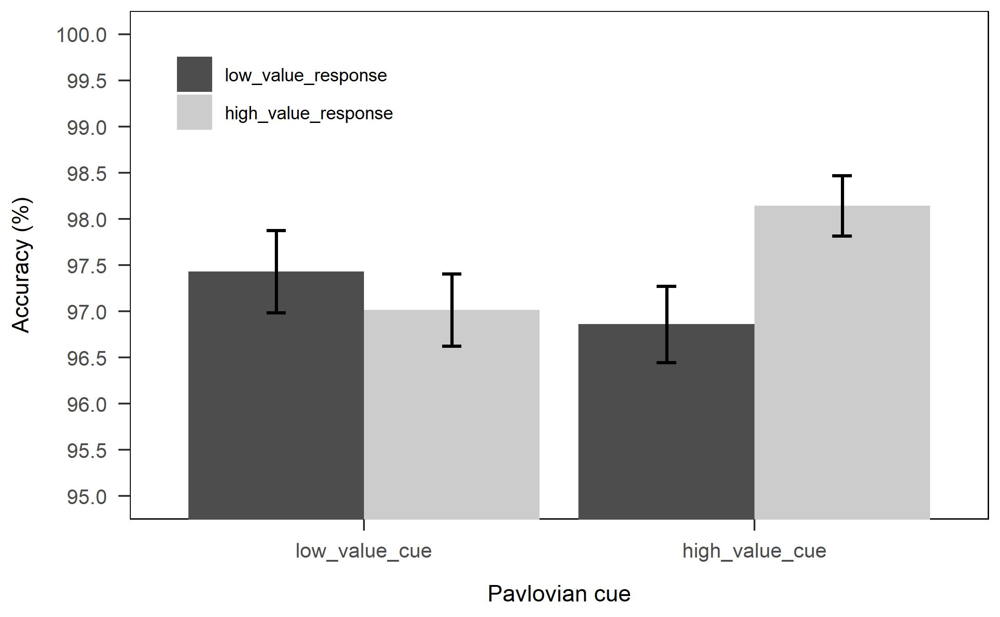]
]
]


---
## Conclusions and the further question

--

- Specific PIT effect is sensitive to the value of outcome

<br>
--

- Supported a goal-directed account for responses to cues (at least in behavior preparation level)

<br>
--

- Whether the manipulation of outcome value may also work for effort spending (controlled process)


---
## Measure efforts 

--

 .center[]


--

- But in a 'forced' way...


--

- Combine the training phases with the Effort mobilization task (Marien et al., 2015)

--

- First response (replicate the previous results), and rest of the responses (effort measure)

--

- Explore whether the instruction (e.g., you need to respond as quick as possible) plays a role in the effects.


---
## Flowchart of the effort measure experiment (an online exp)


.panelset[
.panel[.panel-name[ Demo phase ]
.center[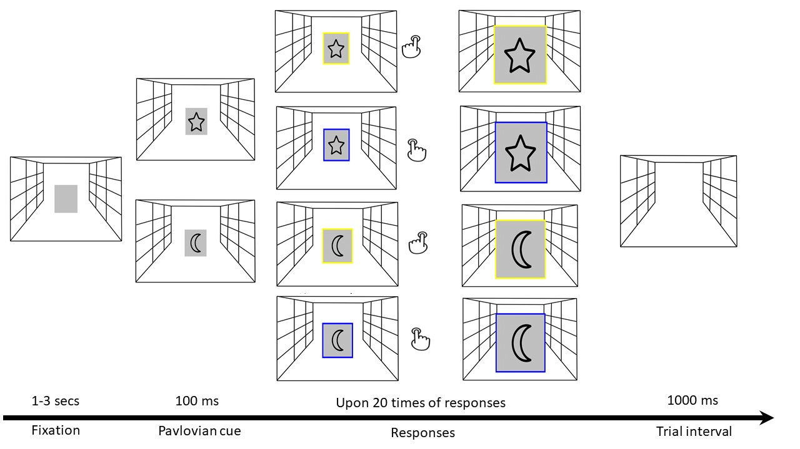]

]

.panel[.panel-name[Instrumental]
.center[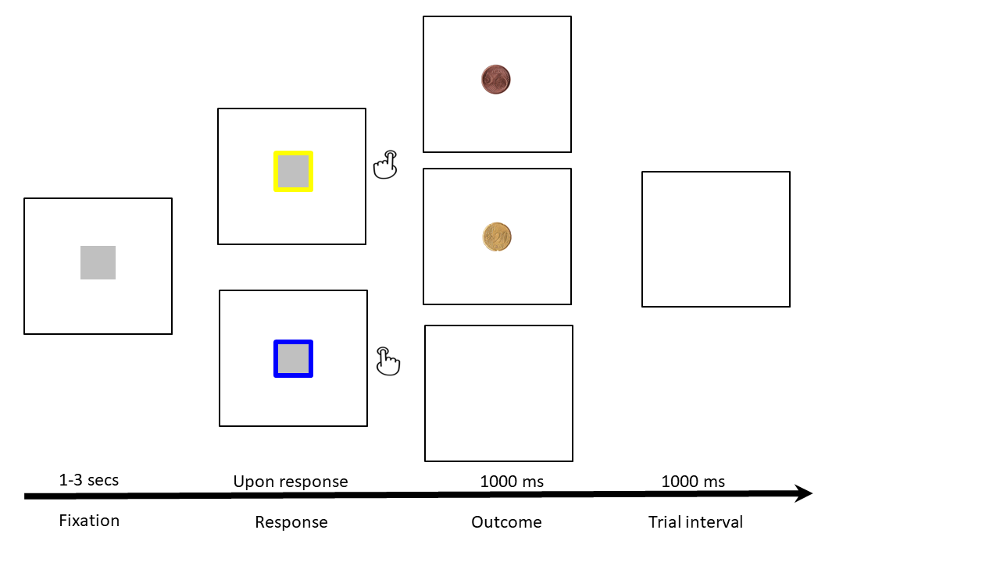]


]

.panel[.panel-name[Pavlovian]
.center[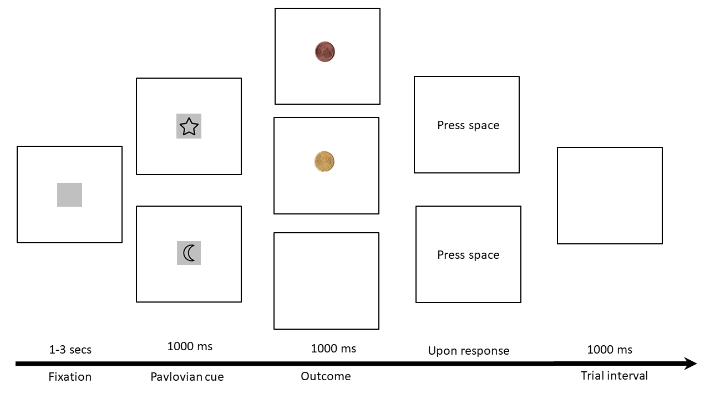]

]

.panel[.panel-name[Transfer test]
.center[]


]
]
---

## Design and hypotheses 

.panelset[
.panel[.panel-name[ Design ]

- DV : RTs and ACCs

- First response: 2(response value: high vs. low)x2(cue value: high vs. low)x2(instruction: with instruction vs. without instruction) 

- Effort measure: 2x2x2x19(19 times of keypresses after the first response)

]

.panel[.panel-name[ Hypotheses ]

- First response: found the [RTs pattern](file:///C:/Users/VULCAN/Desktop/presentation/presentation.html?panelset2=hypotheses-&panelset8=value-effect-2&panelset9=demo-phase-3&panelset10=design-3&panelset11=rts-3&panelset12=rts-4&panelset13=demo-phase-4&panelset14=design-4&panelset15=first-response-rts-2#16) in the instruction group  

- Effort measure: found a three-way interaction effect among response value, cue value and 19 times of keypresses

]
]
---
## Results of the Exp

.panelset[
.panel[.panel-name[ first response RTs ]

.center[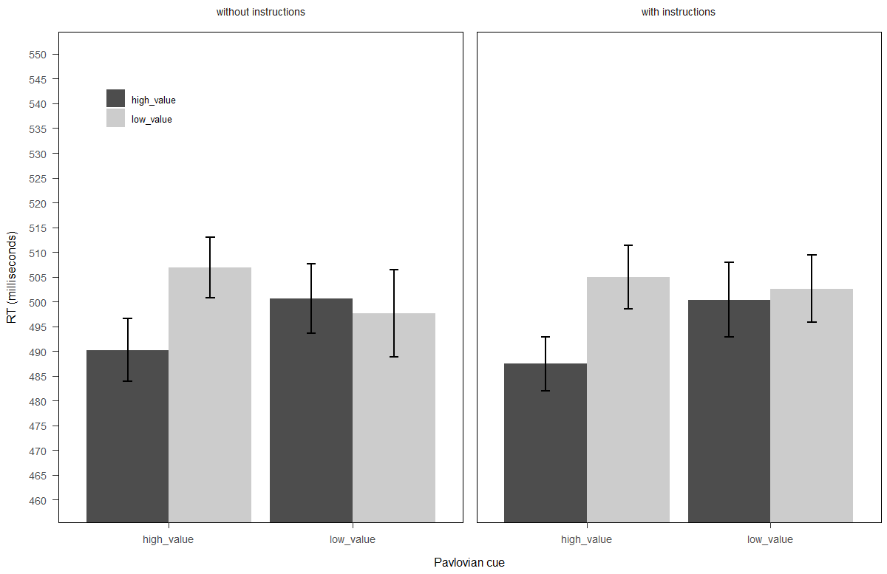]

]

.panel[.panel-name[ first response ACCs ]

.center[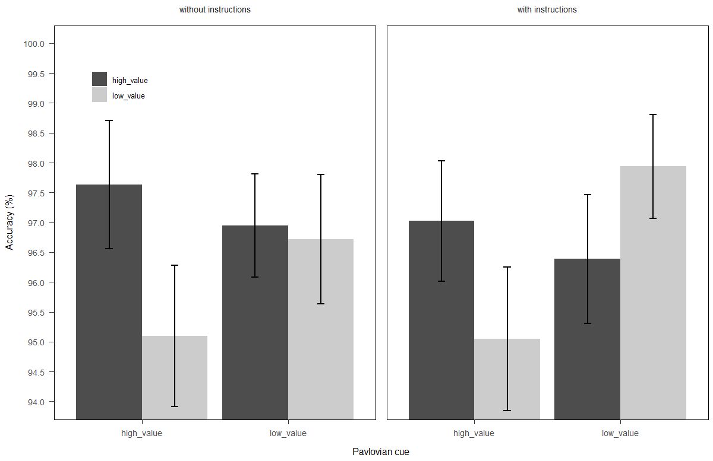]


]


.panel[.panel-name[ effort measure high value cue ]

.center[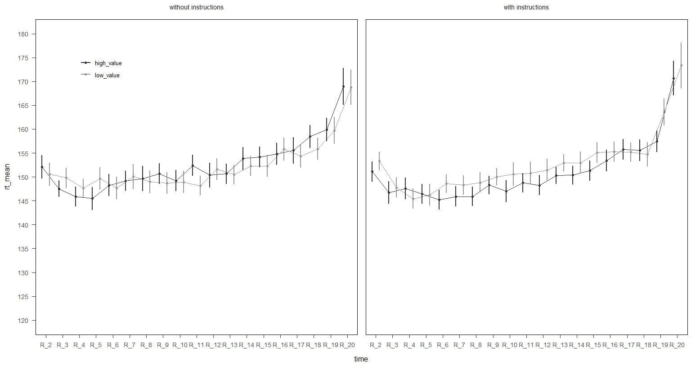]


]


.panel[.panel-name[ effort measure low value cue ]

.center[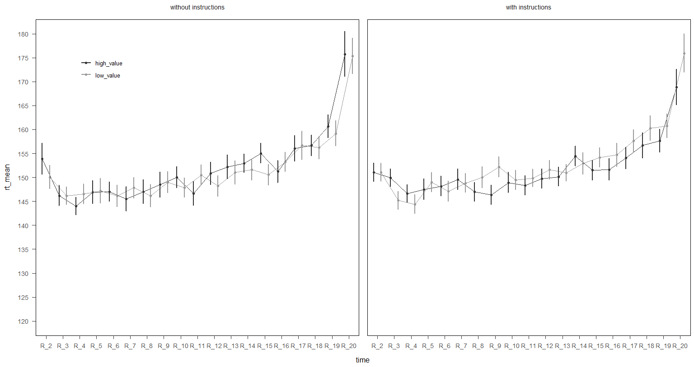]


]

]

---

## Effect of handedness 

.center[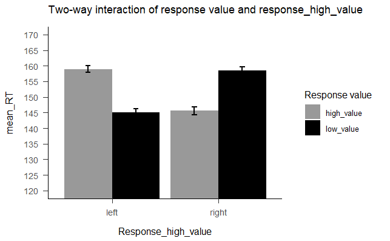]


---
## Conclusions and future studies

--

- Seems that the instruction did not matter for the RTs pattern in the frist response

--

- Handedness effect was the most dominant effect that might kill the effect we wanted to explore

--

- Participants did not get paid when they did the effort mobilization task

--

- What has been trained is not they performed in the effort mobilization task.

---
class: center middle

<span style='font-size:50px;'>Thank your for listening</span>


